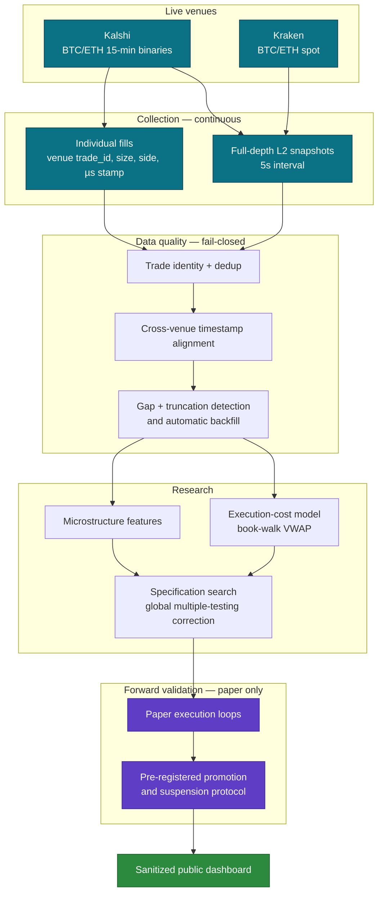

# Prediction Market Execution Lab

Research infrastructure for high-frequency prediction markets and crypto
microstructure. Continuously collects full-depth order books and individual
fills from Kalshi (BTC/ETH 15-minute binaries) and Kraken (BTC/ETH spot), aligns
the two venues on a common clock, models execution cost by walking the book, and
runs candidate strategies forward in paper simulation under a pre-registered
promotion protocol.

**Everything here is paper trading.** No real orders are placed. Where results
are shown they are simulated executions against recorded books, and they are
labelled as such.

---

## What this project studies

Kalshi's short-horizon crypto contracts settle on whether an asset is above a
strike at a fixed expiry, so they are a direct, tradeable probability on a
quantity that also trades continuously on a spot venue. That makes them a clean
laboratory for questions that are hard to isolate elsewhere:

- **Does the prediction market lag the spot book, and by how long?** Both venues
  are recorded at 5-second resolution, so the lead-lag relationship can be
  measured rather than assumed.
- **What does it actually cost to trade a thin binary?** Depth is shallow and the
  edge per contract is cents, so execution cost is not a second-order correction
  — it frequently determines the sign of a strategy.
- **How much of an apparent edge survives multiple-testing discipline?** With
  thousands of specifications searched, the interesting question is not whether
  something looks profitable but whether anything survives a global correction.

On that last question the honest answer so far is *no* for BTC, and that result
is reported here as prominently as anything else.

---

## System architecture



Teal is live recorded data, purple is simulated paper execution, green is the
public surface. Nothing crosses from paper into a live order path.

---

## Selected results

**1. Multiple-testing discipline turns an apparent edge into a null result.**
Across 4,820 specifications (2,410 on BTC, of which 2,236 evaluated cleanly),
no BTC candidate has met the pre-registered promotion threshold in any research
cycle. Individually attractive specifications do not survive the global
search-adjusted p-value. This is the project's most important finding, and it is
a negative one.

**2. Execution cost decides the sign, not the margin.**
On these contracts a strategy's edge per trade is a few cents while walking the
book for a realistic size costs a comparable amount. The break-even win rate is
`w* = p + f/q` — entry probability plus fees over payout — and candidates that
look profitable at mid-price frequently sit below it once filled at book-walk
VWAP. `src/execution/orderbook_vwap.py` is the model used to make that call.

**3. A high-frequency panel large enough to test on.**
1.90M synchronized cross-venue observations and 181 engineered features over a
71-day, 6,645-contract BTC panel at 5-second resolution.

**4. Two ETH candidates in live paper-forward validation.**
Evaluated prospectively against a frozen specification, with promotion and
suspension governed by rules fixed before the evaluation window opened. A
candidate that fails those rules is suspended mechanically rather than by
judgement.

Figures and the live monitoring view are in the dashboard linked below.

---

## Technical highlights

- **Continuous full-depth collection.** 5-second L2 snapshots plus individual
  fills for both assets on both venues, running unattended.
- **Exact trade identity.** Fills carry the venue's own `trade_id`. Deduplicating
  instead on `(instrument, timestamp, price, size, side)` — which looks unique
  and is not — destroys ~7–9% of real fills; measured, not assumed.
- **Fail-closed validation.** A collection run that fetches successfully but
  persists nothing fails the pipeline. "The job ran" and "the data arrived" are
  separate claims and only the second is asserted.
- **Automatic gap recovery.** Missing or truncated days are detected against
  both volume and timestamp-span baselines and refetched inside the venue's
  retention window, so an infrastructure outage is recoverable rather than
  permanent data loss.
- **No-lookahead cross-venue alignment.** Backward-only as-of joins with an
  explicit staleness tolerance; an observation is never matched to reference
  data recorded after it.
- **Pre-registered forward governance.** Hypothesis catalogues are hashed and
  frozen before evaluation, so the promotion decision cannot be rewritten after
  seeing the outcome.

---

## Example code

Purpose-built public implementations of the techniques above. They demonstrate
the method without carrying any strategy parameters.

| module | what it does |
|---|---|
| [`src/execution/orderbook_vwap.py`](src/execution/orderbook_vwap.py) | Walks a limit order book to compute realised VWAP, slippage against the touch, fill fraction and the market-impact curve. Reports partial fills rather than silently completing them. |
| [`src/examples/align_market_data.py`](src/examples/align_market_data.py) | Backward-only as-of alignment of two asynchronous venue streams, with a bounded staleness tolerance and a match-quality report. Includes collection-gap detection. |
| [`src/validation/collection_validation.py`](src/validation/collection_validation.py) | Fail-closed validation of a collected trade file: existence, schema, unique non-null identity, instrument consistency, freshness. Plus dual-signal truncation detection. |

```bash
pip install pandas pytest && python -m pytest tests/ -q     # 37 tests
```

---

## Dashboard

Live paper-forward monitoring: **https://borto3019.github.io/prediction-market-execution-lab/**

Shows the two ETH paper candidates and the BTC null result, refreshed from the
private pipeline. Sanitized: aggregates only, no strategy parameters, no raw
data.

---

## Methodology and honesty notes

Being explicit about what each number is:

- **Live-collected** — order books and fills. Recorded continuously from public
  venue APIs.
- **Simulated execution** — every fill price shown. Orders are walked against the
  book that was standing at decision time. No real orders have been placed.
- **Paper-forward** — the two ETH candidates. Evaluated prospectively against a
  frozen specification, but still simulation, not money.
- **Historical / in-sample** — the specification search. Explicitly not evidence
  of edge; it is the input to the multiple-testing correction, not the output.

No claim is made that this system has demonstrated alpha. The BTC result is a
null, and the ETH candidates are under evaluation with an outcome not yet
established.

---

## Repository boundary

This is a curated public subset of a larger private research system. It contains
documentation, generic implementations of the techniques, sanitized aggregate
results and the public dashboard.

It deliberately excludes raw market data, collector infrastructure, strategy
logic and parameters, candidate-generation internals, governance records and all
credentials. Nothing here can reach the private system: publication is one-way.

Every file is allowlisted, sanitized, secret-scanned and hash-manifested before
it is published.

---

## Author

**Andrea Bortolini** — UCLA Anderson MFE
Quantitative trading · market microstructure · prediction markets

---

*Paper trading only. Nothing here is investment advice or an offer to trade.*
